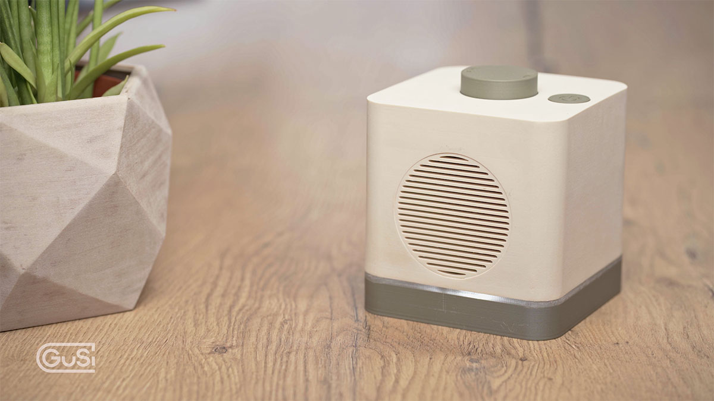
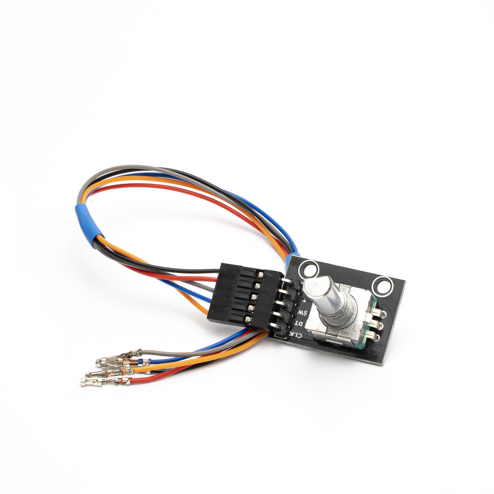
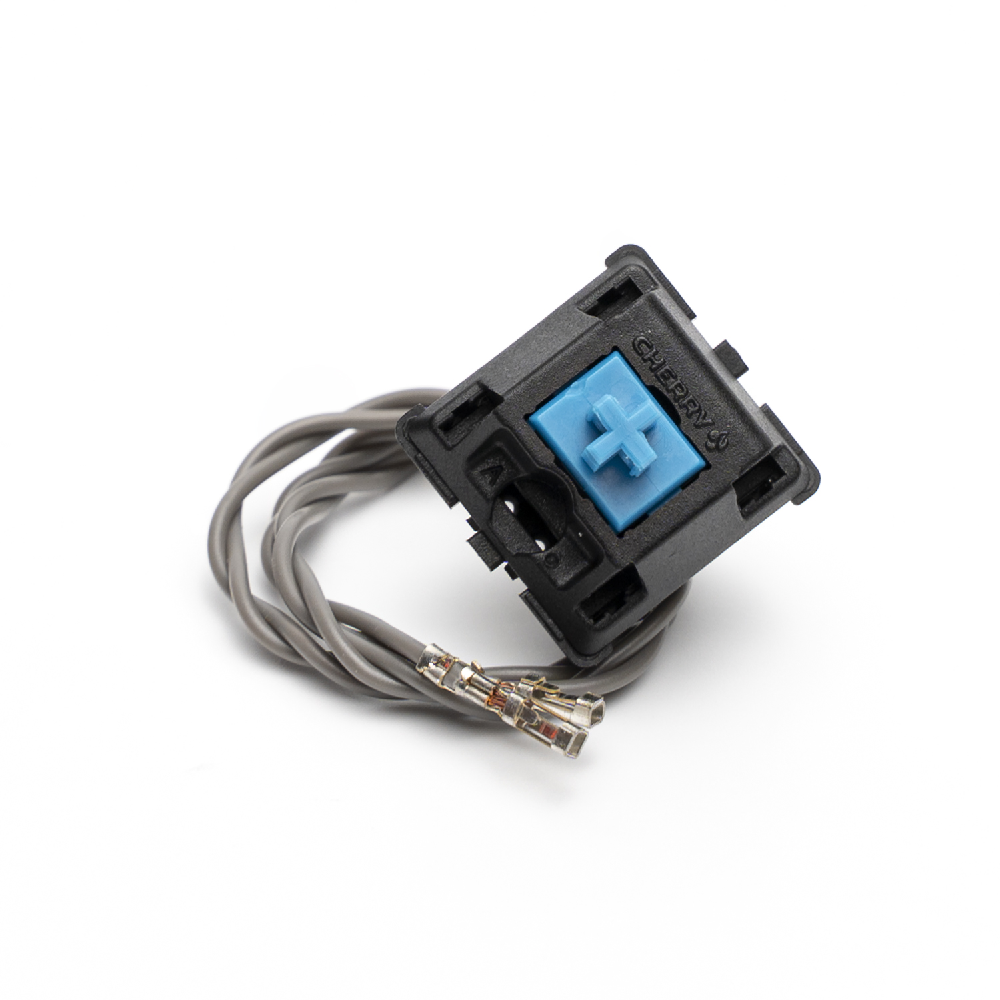
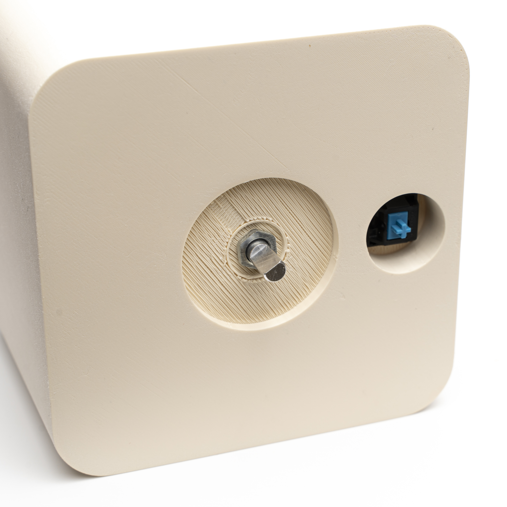
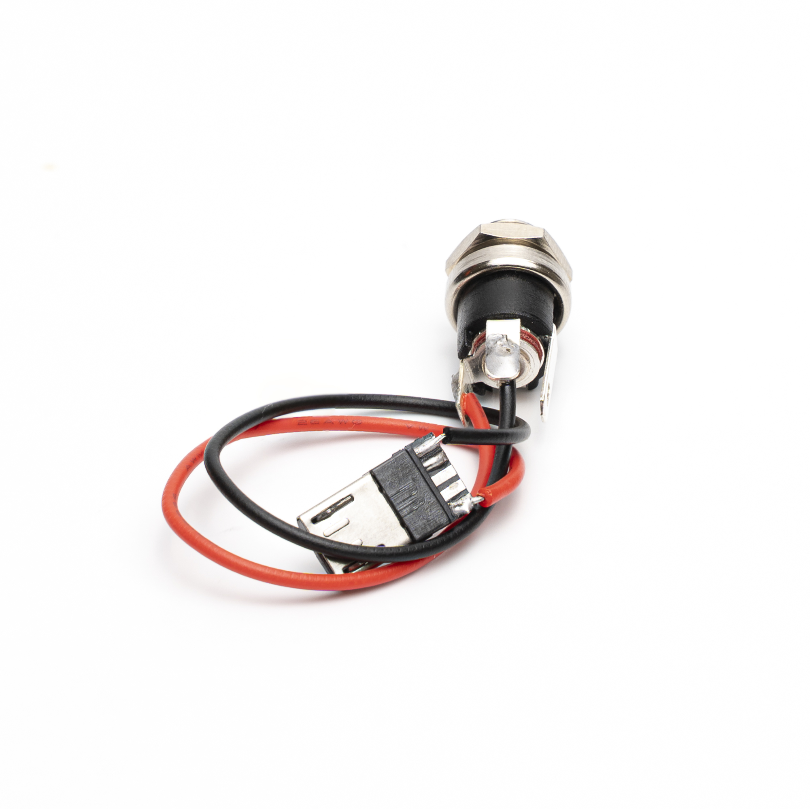
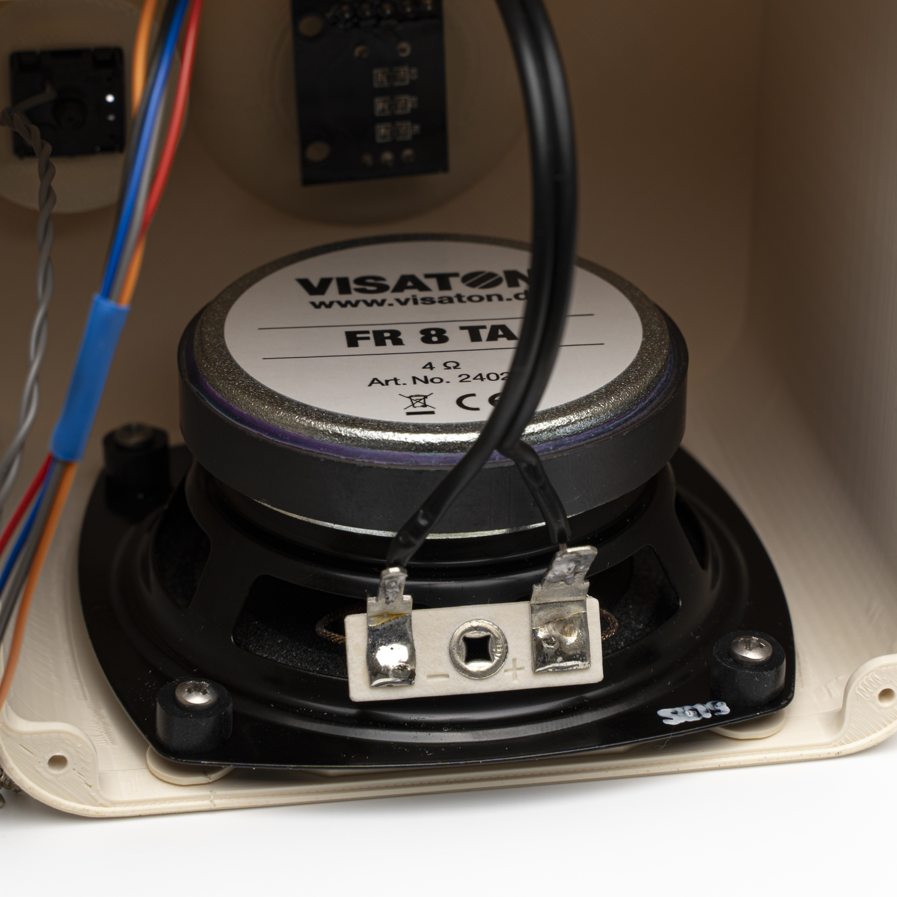
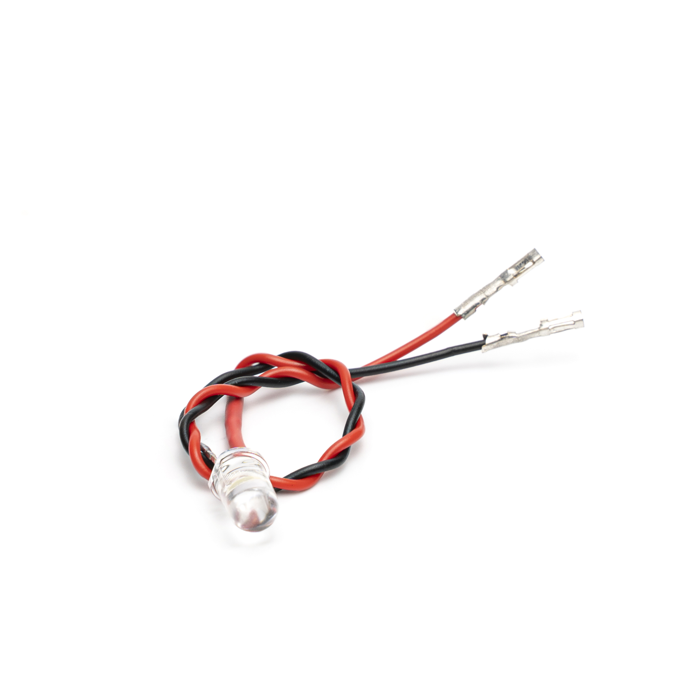
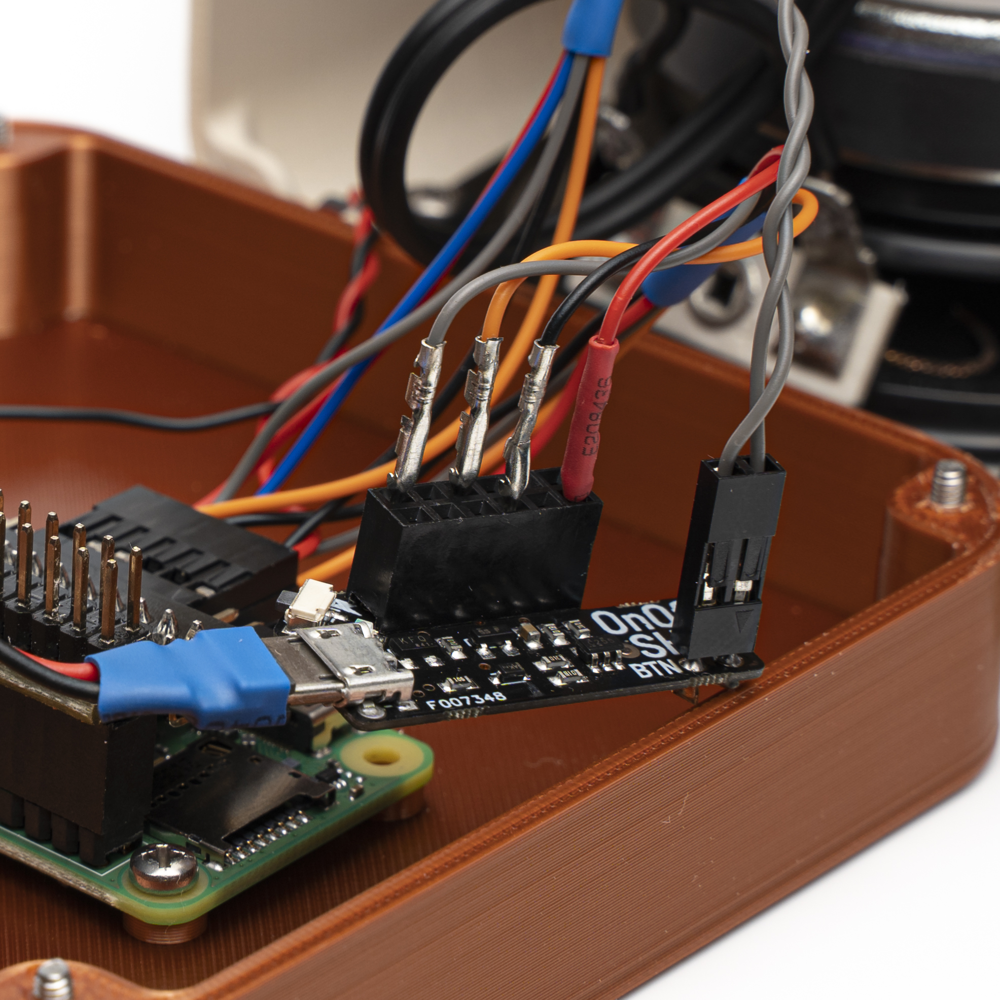
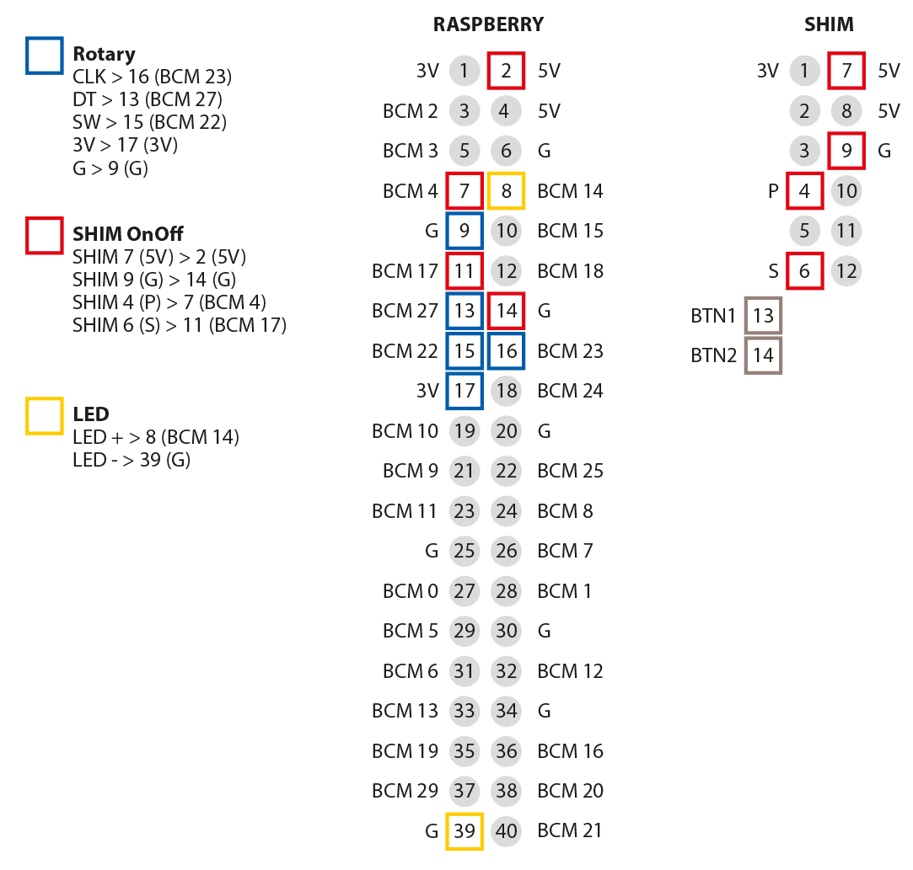
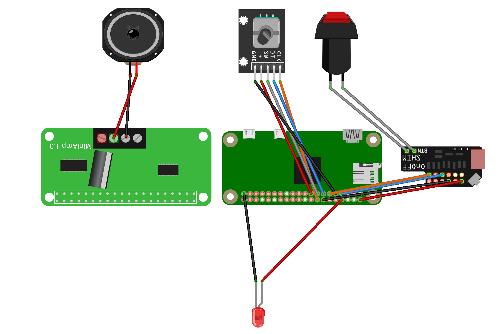

<h1>GuSi-Radio</h1>

GuSi – the user friendly internet radio

The GuSi radio is a very user-friendly internet radio with only two buttons. It allows the user to switch through predefined stations with just one push on the button. This makes it especially suitable for seniors or handicapped people.

A short demonstration of the radio:

[](https://youtu.be/FBuoywtGWyI)

------------
</br>
<div class="warning" style='padding:1em; background-color:#F1C40F; color:black'>
<span>
<p style='text-align:center'>
 <b>WLAN-Anmeldung ohne WPS</b></p>
Öffne das Gehäuse, entnehme die SD-Karte und stecke diese in einen Computer. Öffne den Text-Editor und füge folgenden Code ein:

```
country=DE
ctrl_interface=DIR=/var/run/wpa_supplicant GROUP=netdev
update_config=1
network={
ssid="NAME"
psk="KENNWORT"
}
```

Ersetze <b>NAME</b> und <b>KENNWORT</b> innerhalb der Anführungszeichen durch die WLAN-Anmeldedaten ersetzen.

Speicher das Dokument als Datei speichern als: wpa_supplicant.conf
Achte darauf, dass die Endung ".conf" sein muss und nicht ".txt"!

Datei auf die SD-Karte einfügen, zurück ins Radio setzen und starten.
</div>
<br>
<div class="warning" style='padding:1em; background-color:#F1C40F; color:black'>
<span>
<p style='text-align:center'>
 <b>WiFi registration without WPS</b></p>
Open the housing, remove the SD card and insert it into a computer. Open the text editor and insert the following code:

```
country=EN
ctrl_interface=DIR=/var/run/wpa_supplicant GROUP=netdev
update_config=1
network={
ssid="NAME"
psk="KENNWORT"
}
```

Replace <b>NAME</b> and <b>PASSWORD</b> within the quotation marks with the WiFi credentials.

Save the document as a file Save as:  wpa_supplicant.conf
Make sure that the extension is “.conf” and not “.txt”!

Move the file onto the SD-card, put it back into the radio and start it.
</div>
</br>

<hr>

<h3 style='color: #16A085; font-size: 2em;'> Part list</h3>

<ul>
  <li> 1 x <a href="https://www.reichelt.de/raspberry-pi-zero-2-w-4x-1-ghz-512-mb-ram-wlan-bt-rasp-pi-zero2-w-p313902.html?&nbc=1">Raspberry Pi zero</a>
  
  <li> 1 x <a href="https://www.reichelt.de/raspberry-pi-gpio-header-40-polig-rm-2-54-farblich-kodiert-rpi-header-cg3-p283342.html?&nbc=1">Raspberry Header CG3</a>
  
  <li> 1 x <a href="https://www.reichelt.de/steckernetzteil-12-w-5-v-2-4-a-ea1012ahes501-p293278.html?&nbc=1">Power supply unit (5 V with a barrel jack 2.1 / 5.5 mm)</a>
 
  <li> 1 x <a href="https://www.reichelt.de/raspberry-pi-shield-hifiberry-miniamp-rpi-hb-mini-amp-p191036.html?&nbc=1">Hifiberry MiniAMP</a>
  
  <li> 1 x <a href="https://www.reichelt.de/microsdhc-speicherkarte-32gb-sandisk-ultra-sdsqua4032ggn6ma-p297179.html?&nbc=1">Micro SD Card</a>
  
  <li> 1 x <a href="(https://www.reichelt.de/breitbandlautsprecher-fr-8-ta-10-w-4-ohm-vis-2402-p239748.html?&nbc=1">Small speaker with 10-30 W</a>
  
  <li> 1 x <a href="https://www.reichelt.de/led-5-mm-bedrahtet-kaltweiss-7150-mcd-50--led-el-5-7150kw-p164206.html?&nbc=1">LED 5 mm</a>
  
  <li> 1 x <a href="https://www.reichelt.de/cherry-mx-blue-tastenmodul-schnappbefestigung-cherry-mx1a-e1nn-p202569.html?&nbc=1">Pushbuton (Cherry MX Key)</a>
  
  <li> 1 x <a href="https://www.reichelt.de/einbaubuchse-zentraleinbau-aussen-5-6-mm-innen-2-1-mm-hebl-21-p8524.html?&nbc=1">Power jack socket</a>
  
  <li> 1 x <a href="https://www.reichelt.de/lautsprecherkabel-rot-schwarz-cu-10-m-la-205-10-p9813.html?&nbc=1">Speaker cable (about 0.5 mm²</a>

  <li> 1 x <a href="https://www.reichelt.de/kupferlitze-isoliert-10-m-1-x-0-14-mm-schwarz-litze-sw-p10298.html?&nbc=1">Cable (about 0.14 mm²)</a>

  <li> 1 x <a href="https://www.reichelt.de/micro-usb-stecker-typ-b-5-polig-usb-micro-st-p124013.html?&nbc=1">Micro-USB plug</a>

  <li> 1 x <a href="url">Pan head screw M2.5 6 mm</a>

  <li> 1 x <a href="url">Pan head screw M2.5 10 mm</a>

  <li> 1 x <a href="https://www.reichelt.de/raspberry-pi-gpio-header-1-auf-2-40-polig-rm-2-54-rpi-gpio-1to2-p276993.html?&nbc=1">GPIO edge adapter</a>

  <li> 1 x <a href="https://www.reichelt.de/entwicklerboards-dupont-crimp-set-610-teilig-debo-set-dupont-p279901.html?&nbc=1">Dupont crimps set</a>

  <li> 1 x <a href="https://www.reichelt.de/entwicklerboards-drehwinkel-encoder-ky-040-debo-encoder-p282545.html?&nbc=1">Rotarry encoder KY-040</a>

  <li> 1 x <a href="https://www.reichelt.de/raspberry-pi-shield-onoff-shim-rpi-shd-onoff-p272023.html?&nbc=1">SHIM OnOff</a>
</ul>

Almost everything except the screws can be ordered via this  <a href="https://www.reichelt.de/my/2179350">part list</a>. 

<hr>

<h3 style='color: #16A085; font-size: 2em;'> 3D-Print files</h3>

The 3D-files can be downloaded at <a href="https://www.printables.com/de/model/459099-gusi-radio">printables.com</a>


<hr>

<h3 style='color: #16A085; font-size: 2em;'> Software installation</h3>


<h3>1) Install the OS</h3>

 Install Raspberry Pi OS lite on the SD card. You can use the tool <a href="https://www.raspberrypi.org/software/">Raspberry Pi imager</a>

<b>Raspberry Pi device:</b><br>
Raspberry Pi zero / Raspberry Pi zero 2


<b>Operating system:</b><br> 
Raspberry Pi OS Bullseye (64-Bit)

<div class="warning" style='padding:0.8em; background-color:#F1C40F; color:black'>
Make sure you select "Bullseye" and not "Bookworm" for the Debian version, <br>as the OnOFF SHIM and start.py will not run under Bookworm!
</div><br>

<b>Storage:</b><br> 
elect the SD-Card

Klick on the <b>Next</b> button and allow OS customisation.

<b>General</b>
<li>Hostname: Gusi
<li>Username: gusi
<li>Password: your choise
<li>Set up WIFI: Enter the WiFi login data here
<li>Select your WiFI country
<li>Select time location an keyboard layout
</ul><br><br>

<b>Services</b><br> 
Enable <b>SSH</b> (password)<br><br>

<hr>

<h3>2) SSH Connection</h3>


<color style='color: #16A085'>2.1)</color> Insert the card into the Raspberry and let it boot up. Find out which IP address your Pi got. (You can try ```ping gusi``` in terminal).


<color style='color: #16A085'>2.2)</color> Access the Raspberry via SSH:
```ssh gusi@192.168.1.100```

<hr>

<h3>3) Install the Software</h3> 

<color style='color: #16A085'>3.1)</color> Prepare the configuration file:<br>
  ```
  sudo nano /boot/config.txt
  ```

Comment out the line ```dtparam=audio=off``` by inserting a ‘#’ in front of it. It should look like this: 
```#dtparam=audio=off``` 

Insert the following code at the end of the file:<br>
```
################## GUSI ################
# Disable Bluetooth
dtoverlay=pi3-disable-bt

# Enable Hifiberry Soundcard
dtoverlay=hifiberry-dac
```

Save the change with ```CTRL``` + ```X``` and confirm with ```Y``` and ```Enter```


<br><color style='color: #16A085'>3.2)</color> Install the required packages <br>
```
sudo apt-get update -y && sudo apt-get upgrade -y && sudo apt-get install -y git mpd mpc alsa-utils python3-pip python3-gpiozero
```

<br><color style='color: #16A085'>3.3)</color> Install the required packages <br>
```
sudo apt-get update -y && sudo apt-get upgrade -y && sudo apt-get install -y git mpd mpc alsa-utils python3-pip python3-gpiozero
```
<br><color style='color: #16A085'>3.4)</color> Install the OnOff SHIM for the power control <br>
```
curl https://get.pimoroni.com/onoffshim | bash
``` 
Let the device restart

<br><color style='color: #16A085'>3.5)</color> Clone the Git repository <br>
```
git clone https://github.com/earlmckay/gusi-radio.git
```

<br><color style='color: #16A085'>3.6)</color> Make the script executable and run it (choose between German and English):<br>
 For German:
```
chmod +x /root/gusi-radio/setup_gusi_DE.sh
```
```
sudo /root/gusi-radio/setup_gusi_DE.sh
```
<br>

 For English:
```
chmod +x /root/gusi-radio/setup_gusi_DE.sh
```
```
sudo /root/gusi-radio/setup_gusi_DE.sh
```

<hr>

<h3>4) Customize the Software</h3> 

<color style='color: #16A085'>4.1)</color> Customise the radio stations in <b>stations.json</b>:<br>

The stations are no longer hardcoded in gusi.py. They are described in the file
<b>stations.json</b> at the root of this repository, which is read from GitHub at
every boot (see <a href="#auto-update">Automatic update</a>). Each time the button is
pressed, the radio switches to the next station of that list and plays the matching
announcement (s1.mp3, s2.mp3, ...) to indicate which station can now be heard. The
announcements are generic and say "Station one".

<div class="warning" style='padding:0.8em; background-color:#999999; color:black'>
{<br>
&nbsp;&nbsp;"version": 1,<br>
&nbsp;&nbsp;"stations": [<br>
&nbsp;&nbsp;&nbsp;&nbsp;{ "id": "live", "name": "My live radio", "type": "stream",<br>
&nbsp;&nbsp;&nbsp;&nbsp;&nbsp;&nbsp;"url": "https://server7.stream.com/stream", "updated": "2026-07-28",<br>
&nbsp;&nbsp;&nbsp;&nbsp;&nbsp;&nbsp;"announcement": "s1.mp3" },<br>
&nbsp;&nbsp;&nbsp;&nbsp;{ "id": "archive", "name": "Last show", "type": "mp3",<br>
&nbsp;&nbsp;&nbsp;&nbsp;&nbsp;&nbsp;"url": "https://example.com/show.mp3", "updated": "2026-07-28",<br>
&nbsp;&nbsp;&nbsp;&nbsp;&nbsp;&nbsp;"announcement": "s2.mp3" }<br>
&nbsp;&nbsp;]<br>
}
</div><br>

<table>
<tr><td><b>id</b></td><td>Unique identifier, also used as the local file name for a
mp3 station (<code>id.mp3</code>). Only letters, digits, <code>-</code> and
<code>_</code> are kept.</td></tr>
<tr><td><b>name</b></td><td>Free label, only used in the logs.</td></tr>
<tr><td><b>type</b></td><td><code>stream</code> = played directly from its url.<br>
<code>mp3</code> = downloaded to <code>/var/lib/mpd/music</code> and played
locally.</td></tr>
<tr><td><b>url</b></td><td>http(s) address of the stream or of the mp3 file.</td></tr>
<tr><td><b>updated</b></td><td>Free text (a date is the obvious choice). For a
<code>mp3</code> station, the file is downloaded again as soon as this value differs
from the one recorded locally. Change it whenever you publish a new file behind the
same url.</td></tr>
<tr><td><b>announcement</b></td><td>Optional. Announcement played before the station.
Defaults to <code>s&lt;position&gt;.mp3</code>.</td></tr>
<tr><td><b>enabled</b></td><td>Optional. Set to <code>false</code> to keep an entry in
the file without putting it in the rotation.</td></tr>
</table>
<br>

The number of stations is free: add or remove entries, the rotation follows the order
of the list. A <code>mp3</code> station whose download fails is simply skipped (the
button never lands on silence) and retried at the next boot.<br><br>

<b>Customized announcements:</b><br>
You can, of course, generate your own announcements (by recording them yourself or using TTS). For better identification, the name of the station can be played, for example.<br><br>

You can place the newly generated announcements under the following path: 
```/var/lib/mpd/music/```
<br>(This folder also contains all other radio announcements (e.g. error announcements). You can also regenerate and replace these if necessary.)

As soon as there is a change in the music folder, you must update the database:
```
mpc update
```


<br>

<color style='color: #16A085'>4.2)</color> Customise the WiFi Country in the auto-wps.py:<br>

```
nano /root/gusi-radio/auto_wps.py
```

Search for "country" (Linie 35):


<div class="warning" style='padding:0.8em; background-color:#999999; color:black'>
print("reset wpa_supplicant.conf")<br>
new_config = """ctrl_interface=DIR=/var/run/wpa_supplicant GROUP=netdev<br>
update_config=1<br>
country=<b>DE</b><br>
</div><br>

Replace DE with the required country code (for example "GB")

<hr>

<h3 id="auto-update">4.3) Automatic update</h3>

Once the internet connection is confirmed, <b>start.py</b> runs
<b>updater.py</b> before launching the radio. That script does three things:

<ul>
<li><b>Code:</b> <code>git fetch</code> + <code>git reset --hard origin/&lt;branch&gt;</code>
in <code>/root/gusi-radio</code>, so the device always boots on the latest commit
pushed to GitHub. Local uncommitted changes in that folder are discarded on purpose.</li>
<li><b>Announcements:</b> the mp3 files of the language folder (FR / EN / DE) are copied
to <code>/var/lib/mpd/music</code> when they differ, so a new announcement shipped with
a commit is installed automatically.</li>
<li><b>Stations:</b> <code>stations.json</code> is downloaded from GitHub
(raw.githubusercontent.com). Streams are kept as urls, mp3 stations are downloaded to
<code>/var/lib/mpd/music</code> only when their <code>updated</code> value changed, then
<code>mpc update</code> refreshes the MPD database.</li>
</ul>

The resulting list is written to <code>/var/lib/gusi/stations.json</code> and read by
gusi.py. If the network fails, gusi.py falls back to that cache, then to the
<code>stations.json</code> of the repository, then to a built-in list: an update failure
never prevents the radio from playing. Everything is logged to
<code>/var/log/gusi-update.log</code>.

<b>Configuration</b> — <code>/var/lib/gusi/config.json</code> (created by the setup
script, outside of the repository so it survives updates):

<div class="warning" style='padding:0.8em; background-color:#999999; color:black'>
{<br>
&nbsp;&nbsp;"language": "FR",<br>
&nbsp;&nbsp;"manifest_url": "https://raw.githubusercontent.com/EnhydraV/radiomichel/main/stations.json",<br>
&nbsp;&nbsp;"update_code": true<br>
}
</div><br>

Set <code>update_code</code> to <code>false</code> to only update the stations and leave
the code alone. The update can also be triggered by hand at any time:

```
sudo python3 /root/gusi-radio/updater.py
```

A periodic check (for radios that stay powered on) can be added with cron:
```
sudo crontab -e
```
```
0 4 * * * /usr/bin/python3 /root/gusi-radio/updater.py
```

<div class="warning" style='padding:0.8em; background-color:#F1C40F; color:black'>
The automatic update needs the git repository to stay in <code>/root/gusi-radio</code>.
The <b>setup_gusi_EN.sh</b> and <b>setup_gusi_DE.sh</b> scripts delete
<code>.git</code> at the end of the installation: only <b>setup_gusi_FR.sh</b> keeps it
and sets the update up.
</div>

<hr>

<h3 style='color: #16A085; font-size: 2em;'> Hardware installation</h3>

<h3>5.1) Prepare Cable</h3>
Following cable lengths are required:
<ul>
<li> Loudspeaker: 2 x 120 mm
<li> Rotary encoder: 5 x 200 mm
<li> Pushbutton: 2 x 200 mm
<li> OnOff SHIM: 2 x 100 mm
<li> LED: 2 x 160 mm
</ul>


Insulate both ends by approx. 3 mm.

<hr>

<h3>5.2) Rotary encoder</h3>
The Rotary Encoder has a total of 5 pins:

<ul>
<li>  GRD: Ground
<li>  +: voltage
<li>  SW: Push
<li>  CLK: Primary rotation
<li>  DT: Phase shifted rotation 
</ul>

Crimp the 5 prepared cables with a female Dupon connector on each side and connect the cables to the Rotary Encoder.



<h3>5.3) Prepare the pushbutton</h3>
For the pushbutton, one part of the cables must be soldered to the button, the other ends get a female Dupon connector.
Crimp the 5 prepared cables with a female Dupon connector on each side and connect the cables to the Rotary Encoder.



<h3>5.4) Insert the rotary control and the button</h3>
Now you can screw the rotary encoder into the middle hole of the case. Make sure that it sits straight, otherwise the knob will wobble.
The push button is inserted into the outside of the case. It should snap into place. 




<h3>5.5) Power supply</h3>

Before you insert the power socket, solder the cables first. This is more comfortable and avoids damaging the plastic housing. 
Seen from the back, the positive pole is on the left and the negative pole on top.

Now you can solder the cables to the micro USB connector. 
The left contact is the positive pole, the one on the right side is the negative pole (see picture).




------------

 <h3>5.6) Loudspeaker</h3>

First the easy part. Solder two cables to the two speaker contacts. 
The other ends of the cables do not need to be worked on, as they will be clamped into the amplifier later. 

Before you screw in the speaker, the speaker grille must be inserted first. Make sure that the holes are exactly aligned with those in the housing.
Now place the speaker in the cabinet on the grille and fix it with the 6 mm screws.



------------

 <h3>5.7) LED</h3>
For the LED you need the two prepared cables and two female Dupon connectors, which are crimped on one side of the cable. 
The other sides have to be soldered to the LED itself. I used here for the anode (longer pin of the LED) the red cable and for the shorter side (cathode) the black cable. To avoid a short circuit, a heat shrink tube can be used.
Now push the LED into the holder.



------------

 <h3>5.8) OnOff SHIM</h3>
The board comes with optional female connectors, which I also used. For the two button contacts I cut and soldered two male Dupon connectors.
The pre-assembled cables can now be equipped with a male Dupon connector on one end and a female connector on the other end. 



<hr>

 <h3>5.9) Connection</h3>
First, the Raspberry can be screwed to the lower base plate.
Then the GPIO corner adapter can be plugged on, followed by the MiniAmp.

Then everything can be connected one by one.

1) Rotary Encoder to Raspberry
2) SHIM OnOff with Raspberry
3) Pushbutton with SHIM OnOff
4) LED with Raspberry
5) Power supply with SHIM On Off
6) Speaker with MiniAmp





<hr>

Finally, I would like to thank [Robert Nickel](https://github.com/Robert-Nickel) for his support, as well to [Notification Sounds](https://notificationsounds.com/) for providing the sounds.


<style>
h1 {
  color: #16A085;
  font-size: 6em;
  border-bottom: 0;
}

h2 {
  color: #16A085;
  font-size: 2em;
  border-bottom: 0;
}

h3 {
  color: #16A085;
}

/* unvisited link */
a:link {
  color: #16A085;
}

/* visited link */
a:visited {
  color: #16A085;
}

/* mouse over link */
a:hover {
  color: #16A085;
}

/* selected link */
a:active {
  color: #16A085;
}
</style>